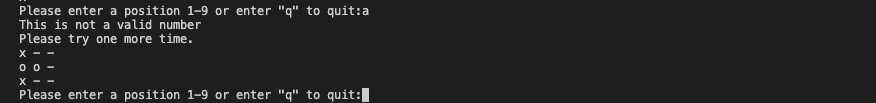
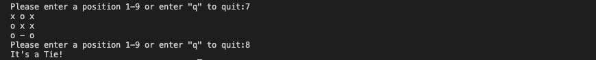

# TIC TAC TOE
### Play the classic game of Tic Tac Toe. A game for two players who take turns marking the spaces in a three-by-three grid with X's or O's. The player who succeeds in placing three of their marks in a horizontal, vertical, or diagonal row is the winner!
&nbsp;

## Live Site
---
[Heroku](https://tic-tac-toe-third-port-project.herokuapp.com/)

## Repository
---
[Github](https://github.com/HannaBerggren/tic-tac-toe)
&nbsp;

## Table of Contents
---

- [UX](#ux)
    - [Website owners goals](#website-owners-goals)
    - [Users goals](#users-goals)
    - [Flow Chart](#flow-chart)
- [Features](#features)
    - [Game](#game)
    - [Future features](#future-features)
- [Technologies used](#technologies-used)
- [Testing and Validation](#testing-and-validation)
    - [PEP8](#pep8)
    - [Manual testing](#manual-testing)
    - [User stories testing](#user-stories-testing)
    - [Bugs](#bugs)
    - [Unfixed Bugs](#unfixed-bugs)
- [Deployment](#deployment)
    - [How to deploy](#how-to-deploy)
- [Credits](#credits)

&nbsp;

## UX
---

### Website owners goals
- To offer entertainment to the user willing to play the game.
- Provide simple information about the game.
- Provide options to the user to continue or to quit during the entire game.

&nbsp;

### Users goals
For new users:
- To play a game of Tic Tac Toe against the computer.
- To easily navigate in commands and interface.
- To always have reference navigation commands always available.

Returning visitors:
- To practice their Tic Tac Toe skills playing against the computer.
- To be able to play Tic Tac Toe as many times as they want

&nbsp;

### Flow Chart
To create the structure of the game, this diagram was created using [Lucid Charts](https://www.lucidchart.com/) 

&nbsp;

&nbsp;

[Back to Table of contents](#table-of-contents)

&nbsp;

## Features
---

### Game
Here's what the program does and how the game plays:

1. A text showing the user how to play or quit.

2. Once the user has chosen their second move, the same instruction comes up again, and so on...

3. If the user selects a box that is already occupied, a message to select again is displayed.

4. If the user selects a number that's not between 1-9, a text will pop up to try again.

5. If the user accidentally enters a letter or similar, a text is displayed that it's not a number.

6. When you or the computer win, a text of the winner is displayed.

7. When it's a tie, it's displayed with a text.

8. If the user decides to quit the game, a text is shown that welcome the user to play again.

&nbsp;

### Future features
---
- Give an option to the user to choose the symbol they want.
- Let user dicide if they want to go first or second.
- Online multiplayer: the ability to play online with friends.
- Improve the computer difficulties in different levels: easy, intermediate and hard.
&nbsp;

[Back to Table of contents](#table-of-contents)

&nbsp;

## Technologies Used
---

- Python: Python was the language used throughout the project.
- Markdown: Markdown language was used troughout writing the README.md
&nbsp;

[Back to Table of contents](#table-of-contents)

&nbsp;

## Testing and Validation
---

### PEP8
The code was checked with PEP8 validator and passed with no error found.
&nbsp;

### Manual testing
All features have been tested manually with a MacBook Air and a Chromebook with multiple browsers (Chrome, Safari, Firefox).

&nbsp;

### User stories testing
For the program owner:
- The game offers joy to the users and the chance to play it multiple times.
- The game contains informations about the game during every step they play.
- The game give options to the user to quit the game at each move.

For new users and returning visitors:
- The user can improve their skill at the game excercising with this program which puts them against the computer.
- The user can navigate through the game with easy commands.
- Always available reference of the possible choices when making a move, makes it easy to find the right commands.
&nbsp;

[Back to Table of contents](#table-of-contents)
&nbsp;

### Bugs
- When starting the game it showed two gameboards, fixed it by removing a print statement of the gameboard that was one to much. 
- Some lines were too long and there was too little space between functions. I also removed multiple whitespaces.

&nbsp;

### Unfixed Bugs
- None that I'm aware of right now.

&nbsp;

## Deployment
There is only this main branch of the project version available in GitHub.
This version is also deployed live on Heroku.

### How to deploy
To deploy this page to Heroku from its [GitHub repository](https://github.com/HannaBerggren/tic-tac-toe) the following steps were taken:

- Log into or register a new account at [Heroku](https://www.heroku.com/).
- Click on the button **New** in the top right corner of the dashboard.
- From the drop-down menu then select **Create new app**.
- Enter your app name in the first field, the names must be unique so check that then name you have chosen is available on Heroku, then select your region.
- Click on **Create App**.
- Once the app is created you will see the Overview panel of the application. Now move to the **Settings** tab.
- Once you are in the **Settings** tab scroll down till you find **Config Vars**.
- Press the button **Reveal Config Vars** and for 'KEY' field, type in 'PORT' and for the value field type in '8000'.
Then press the **Add** button.
- Scroll down to **Buildpacks**. Click the button **Add buildpack** and select 'python'. Do the same step and add 'node.js'.
**PYTHON must be on top of the buildpacks. If in your case NODE.JS is first, click and drag PYTHON to the top and save.**
- Return back to the **Deploy** tab. From the deployment method, select 'Github' as the deployment.
- You will be asked to connect your github account. Confirm and proceed.
- Search for your repository name and connect.
- Once that is done and successfully connected, select how you want to push updates from the following options.

  _Clicking **Enable Automatic Deploys**. This will update once you push updates to your Github._

  _Selecting the correct branch for deployment from drop-down menu and pressing **Deploy Branch** button. This will have to be done everytime manually._

&nbsp;

[Back to Table of contents](#table-of-contents)

&nbsp;

## Credits
---
- Youtube - for great inspiration!
- [Stackoverflow](https://stackoverflow.com/)
- [W3 Schools](https://www.w3schools.com/)
- My cousin - for her great support!

&nbsp;

[Back to Table of contents](#table-of-contents)